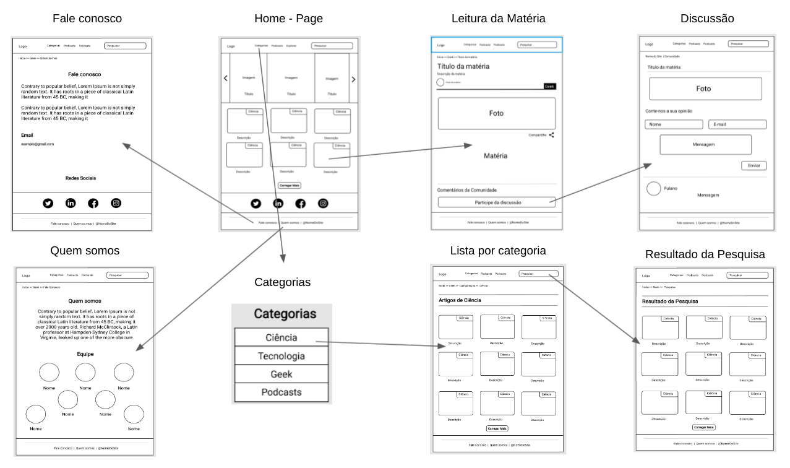

# Projeto de Interface

Dentre os diversos objetivos que temos neste projeto, estamos direcionando nosso foco para uma melhor experiência do usuário. Ou seja, acessibilidade, usabilidade, agilidade. Pensando nisso, o projeto tem uma identidade visual padronizada em todas as telas que são projetadas para o funcionamento em desktops ou plataformas mobile (celular, tablet, etc).

## Fluxo do Usuário

O diagrama mostrado na figura abaixo mostra a interação do usuário pelas telas da plataforma. Cada uma dessas telas é detalhada de forma mais aprofundada na seção de Wireframes.

Figura I - Diagrama de telas.

## Wireframes

Cada página criada para a plataforma segue um padrão de estrutura, os três blocos:

* **Cabeçalho/Header**: local que se encontra a barra de navegação e o logotipo do site.
* **Conteúdo/Body**: local que se encontra todo o material que o usuário irá consumir, sendo texto, imagem, vídeo, etc.
* **Rodapé/Footer**: local que se encontram as informações “Fale Conosco”, “Quem Somos” e o “Nome do Site”.

Figura II - Composição do site.

### Tela - Homepage

A tela de homepage é o local que se encontra toda a centralização do website. Ou seja, conteúdo em destaque e funcionalidades gerais, também. Sendo elas:

* Componente de **pesquisa** que permite filtrar o conteúdo da página de acordo com o que o usuário pesquisar;
* Componente de **categorias** que permite filtrar o conteúdo da página de acordo com palavras chaves pré-definidas pelo o website;
* Componente de **carregar mais** conteúdo que aparece de acordo com a sua relevância;
* Componente de **explorar** que mostra um pouco de cada parte do site;
* Componente de **podcasts** que leva à uma página em que se encontram os podcasts que já ficaram disponíveis no site;
* Componente **carrossel** que mostra os conteúdos do site com um maior destaque. 

Figura III - Tela - Homepage

### Tela - Notícia

A tela de de notícia é a página que se encontra o conteúdo em questão. Ainda que esteja seguindo o mesmo layout da homepage, tem o adendo do componente de participar da discussão, que leva para a página de comentários.

Figura IV - Tela - Notícia

### Tela - Discussão

Nesta tela é o local que o usuário pode discorrer sobre a notícia. Nela, se encontra o “Título da Matéria", seguido da imagem da notícia em questão. Para que o usuário possa comentar, é necessário que seja inserido seu “Nome”, “E-mail” e a “Mensagem” que quer que seja enviada na sessão de comentários. Após isso, é necessário clicar em “Enviar”. 

Figura V - Tela - Discussão

### Tela - Artigos por categoria

A tela de categorias é onde se encontra a categoria específica que o usuário quer ver, indiferente da relação de relevância de cada notícia. Havendo, também, a possibilidade de **carregar mais** conteúdo dessa mesma categoria.

Figura VI - Tela - Artigos por categoria

### Tela - Pesquisa

Após o usuário pesquisar o que deseja, é aqui que os resultados da pesquisa aparecerão. Incluindo notícias, artigos, vídeos, podcasts, etc, que contenham as palavras chaves em questão.

Figura VII - Tela - Pesquisa

### Tela - Quem somos

Toda informação relacionada a nós, incluindo a nossa história, quem somos como empresa e os integrantes da equipe, se encontram nessa tela.

Figura VIII - Tela - Quem somos

### Tela - Fale conosco

Havendo a necessidade do usuário nos contatar, ele poderá nos encontrar via redes sociais ou entrar em contato conosco inserindo o seu email.

Figura IX - Tela - Fale conosco

