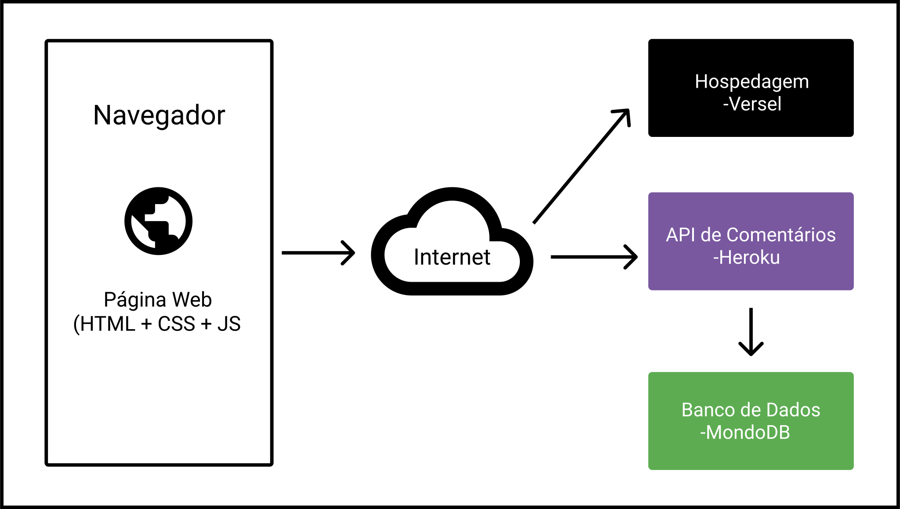

# Arquitetura da Solução

Nessa seção são apresentados os detalhes técnicos da solução criada pela equipe, tratando dos componentes que fazem parte da solução e do ambiente de hospedagem da solução.

## Diagrama de componentes

Os componentes que fazem parte da solução são apresentados na figura abaixo.

Figura X - Arquitetura da Solução

A solução implementada conta com os seguintes módulos:

- **Navegador** - Interface básica do sistema  
  - **Páginas Web** - Conjunto de arquivos HTML, CSS, JavaScript e imagens que implementam as funcionalidades do sistema e contém as informações das
  matérias de forma estática.

 - **Hospedagem** - local na Internet onde as páginas são mantidas e acessadas pelo navegador.     
 - **API de Comentários** - back-end responsável por prover e guardar os comentários dos usuários.
 - **Banco de dados** - local onde são armazenados os dados de comentários. 

## Hospedagem 

O site utiliza a plataforma do Versel como ambiente de hospedagem do site do projeto. O site é mantido na URL. <https://vercel.com/exemplo/informations>

A publicação do site no Versel é feita dinamicamente através de uma submissão do projeto (push) via git para o repositório do projeto no GitHub que é sincronizado com o Versel.<https://github.com/ICEI-PUC-Minas-PMV-ADS/pmv-ads-2021-2-e1-proj-web-t6-ads_2021_02_e1_grupo_02>
 
