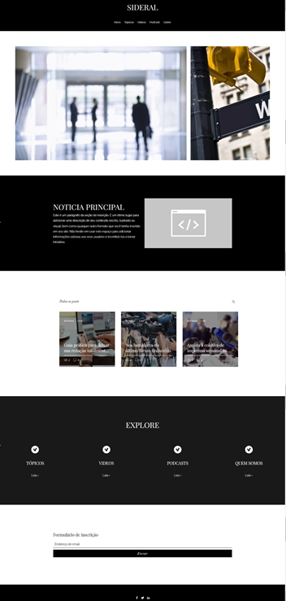

# Template padrão do site

Padrão de layout a ser utilizado pelo site:

Figura 12 - Template Padrão do Site

O template criado é composto pelos seguintes layouts:

**Cabeçalho/Header**: local que se encontra a barra de navegação, com os links para “Início”, “Tópicos”, “Vídeos”, “Podcasts” e “Sobre”, além do logotipo do site.

**Conteúdo/Body**: local que se encontra todo o material que o usuário irá consumir, sendo texto, imagem, vídeo, etc.

**Rodapé/Footer**: local no qual se encontram os ícones para as redes sociais do site.

## Tela Principal

Tela central  onde se concentra todas as informações do site e locais de acesso para outras páginas. 

Figura 13 - Tela Principal

