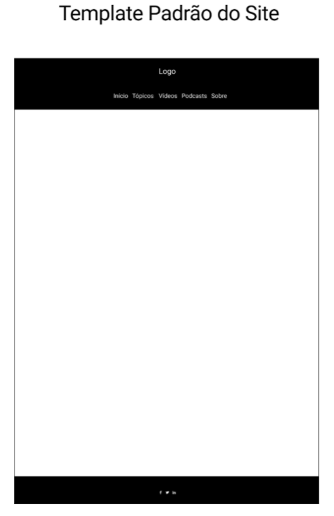

# Template padrão do site

Padrão de layout a ser utilizado pelo site:

Figura 12 - Template Padrão do Site

O template criado é composto pelos seguintes layouts:

**Cabeçalho/Header**: local que se encontra a barra de navegação, com os links para “Início”, “Tópicos”, “Vídeos”, “Podcasts” e “Sobre”, além do logotipo do site.
**Conteúdo/Body**: local que se encontra todo o material que o usuário irá consumir, sendo texto, imagem, vídeo, etc.
**Rodapé/Footer**: local no qual se encontram os ícones para as redes sociais do site.

## Cabeçalho/Header 

## Conteúdo/Body

## Rodapé/Footer

