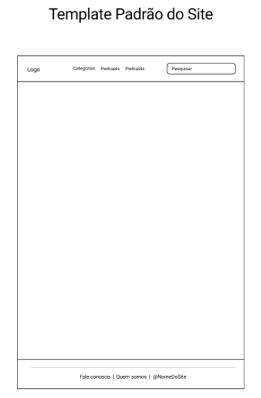

# Template padrão do site

O padrão de layout a ser utilizado pelo site tem correspondência ao projeto de Interface elaborado anteriormente:

Figura 12 - Template Padrão do Site

O template criado é composto pelos seguintes layouts:

**Cabeçalho/Header**: local que se encontra a barra de navegação e o logotipo do site.
**Conteúdo/Body**: local que se encontra todo o material que o usuário irá consumir, sendo texto, imagem, vídeo, etc.
**Rodapé/Footer**: local que se encontram as informações “Fale Conosco”, “Quem Somos” e o “Nome do Site”.

## Cabeçalho/Header 

## Conteúdo/Body

## Rodapé/Footer

