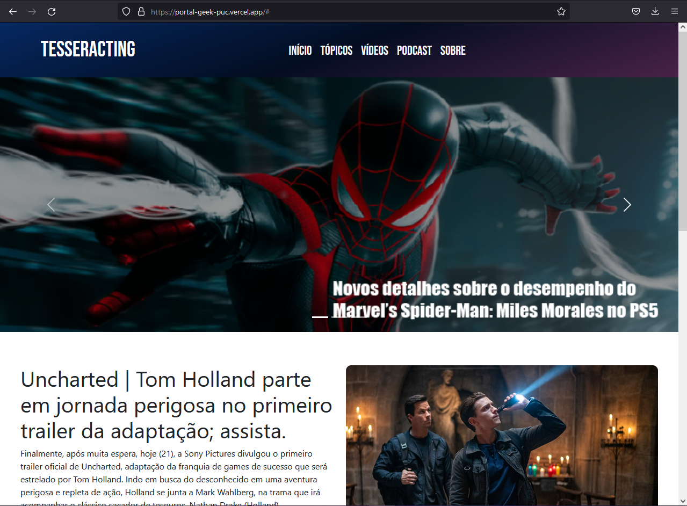
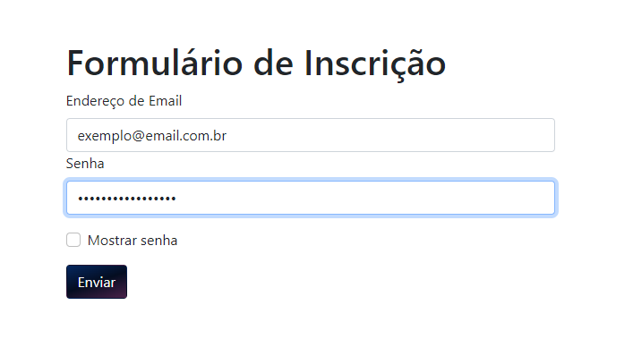

# Programação de Funcionalidades

As telas a seguir apresentam algumas funcionalidades que foram desenvolvidas para o projeto, bem como a URL de acesso.

# Home-Page

A tela inicial do site é composta por 4 estruturas:

- Cabeçalho 
- Área de notícias
- Área de cadastro
- Rodapé

- O cabeçalho contém a logo do site e também a barra de navegação que tem a funcionalidade de navegar entre as diversas páginas do site.

- Abaixo do cabeçalho contém o corpo site contendo a área de notícias totalmente responsiva para apresentação dos elementos disponíveis no site.

- A área de login é responsável por cadastrar o usuário para posíveis interações do tipo comentários em posts.

- O Rodapé contém informações sobre o desenvolvedor.

O site está disponível no link <a>https://portal-geek-puc.vercel.app/</a>

- **Requisito Funcional (RF-001):** - O site deve apresentar na página principal notícias estáticas inclusas pelo próprio administrador.

* **Artefatos da funcionalidade**:

  - index.html
  - style.css
  - imgs

# Formulário de inscrição

- **Requisito Funcional (RF-009):** - O site deve permitir ao usuário a se cadastrar através de um formulário de inscrição.

* **Artefatos da funcionalidade**:

  - index.html
  - style.css
