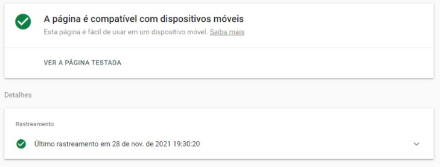
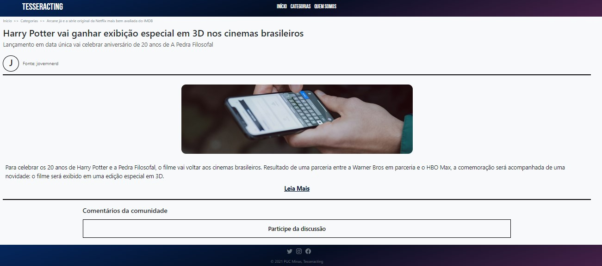
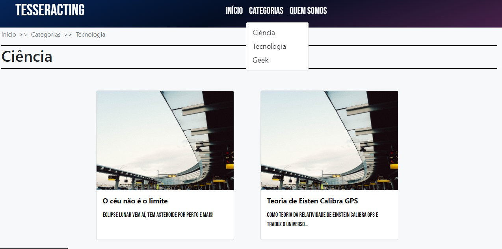
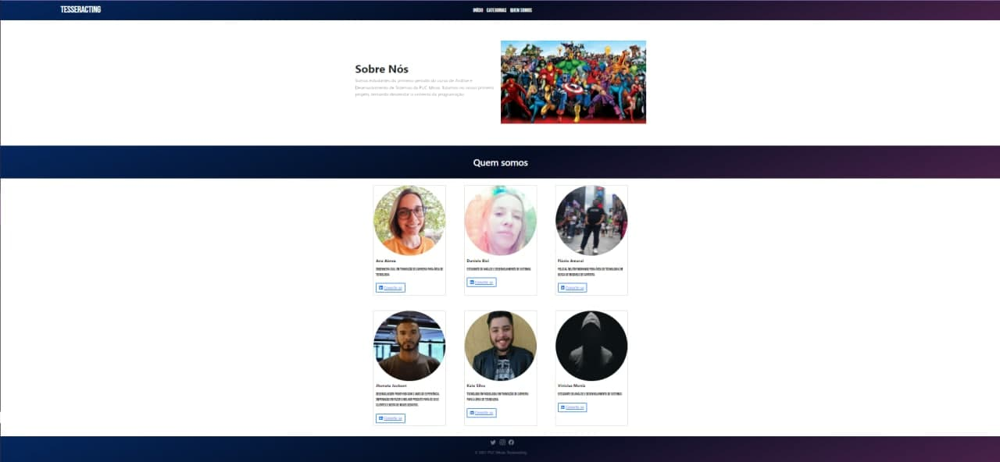
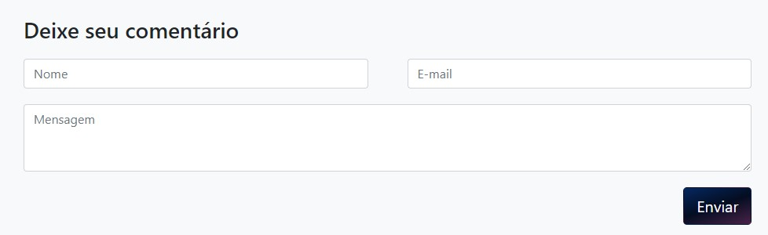

# Registro de Testes de Software

Teste de Responsividade

Teste de Links quebrados

# Registro de Testes baseados nos planos de testes

| CASO DE TESTE         | CT- 01 - Carregamento da página Home                                                                                                                                                                                |
| --------------------- | ------------------------------------------------------------------------------------------------------------------------------------------------------------------------------------------------------------------- |
| Requisitos Associados | RF-01 - O site deve apresentar na página principal notícias estáticas incluídas pelo próprio administrador. RF-02 - O site deve apresentar, para cada publicação, uma imagem correspondente ao assunto apresentado. |
| Objetivo do Teste     | Verificar se a carga de notícias está acontecendo corretamente.                                                                                                                                                     |
| Critérios de Êxito    | A página Home deve ser carregada, com as imagens visíveis e todos os links devem direcionar o usuário para as páginas correspondentes a sua seleção.                                                                |

Passos:

- Acessar o Navegador
- Informar o endereço do site - https://portal-geek-puc.vercel.app/
- Visualizar a página principal

Tela:

| CASO DE TESTE         | CT- 02 - Visualizar detalhes das notícias                                                                                                   |
| --------------------- | ------------------------------------------------------------------------------------------------------------------------------------------- |
| Requisitos Associados | RF-03 - O site deve permitir ao usuário visualizar o texto completo da publicação com todos os detalhes                                     |
| Objetivo do Teste     | Verificar se ao clicar nas imagens e links das páginas de notícias, está ocorrendo o redirecionamento para a página com a notícia completa. |
| Critérios de Êxito    | Ao clicar na imagem ou parágrafo com link deve ser carregada a página com a notícia completa. Título da notícia, imagem destaque e texto.   |

Passos:

- Acessar o Navegador
- Informar o endereço do site - https://portal-geek-puc.vercel.app/
- Clicar nas imagens com links para notícia
- Clicar nos chamadas de notícia com links

Tela:

| CASO DE TESTE         | CT- 03 - Funcionamento do menu adicional                                                                                                                                                                                  |
| --------------------- | ------------------------------------------------------------------------------------------------------------------------------------------------------------------------------------------------------------------------- |
| Requisitos Associados | RF-04 - O site deve oferecer um menu adicional que permita ao usuário visualizar notícias de fontes similares (sources)                                                                                                   |
| Objetivo do Teste     | Verificar se ao clicar no menu adicional criado para direcionamento para outras aplicações similares aparecerá os nomes das outras fontes e se ao clicar em cada nome se abrirá uma nova aba com a aplicação relacionada. |
| Critérios de Êxito    | Ao clicar em cada fonte relacionada no menu adicional, a página da fonte deve abrir e carregar em uma nova aba do Navegador.                                                                                              |

Passos:

- Acessar o Navegador
- Informar o endereço do site - https://portal-geek-puc.vercel.app/
- Clicar no menu adicional

Tela:

| CASO DE TESTE         | CT- 05 - Carregamento da página Quem somos                                                 |
| --------------------- | ------------------------------------------------------------------------------------------ |
| Requisitos Associados | RF-06 - O site deve permitir visualizar as informações de contatos do mantenedor do site.  |
| Objetivo do Teste     | Verificar se a carga com as informações do mantenedor do site está ocorrendo corretamente. |
| Critérios de Êxito    | A página Quem Somos deve ser carregada com todos os itens.                                 |

Passos:

- Acessar o Navegador
- Informar o endereço do site - https://portal-geek-puc.vercel.app/
- Clicar no menu Quem Somos
- Visualizar a página

Tela:

| CASO DE TESTE         | CT- 07 - Campo para comentários nas publicações                                                                                                                                                                                                                                                                                     |
| --------------------- | ----------------------------------------------------------------------------------------------------------------------------------------------------------------------------------------------------------------------------------------------------------------------------------------------------------------------------------- |
| Requisitos Associados | RF-08 - O site deve permitir que usuários possam comentar publicações                                                                                                                                                                                                                                                               |
| Objetivo do Teste     | Verificar se o campo aberto para comentários está funcionando, incluindo o envio dos dados digitados e a saída na página do comentário efetuado. Verificar se ao atingir a quantidade máxima de caracteres se não é permitido digitar mais informações. Chegar se a ordem de comentários está do mais recente para o menos recente. |
| Critérios de Êxito    | Ao clicar no campo de comentários que esteja aberto para digitação de texto e números, dentro da quantidade máxima de caracteres permitida e que após clicar no botão de envio, que a mensagem digitada seja postada na página embaixo da notícia em ordem da mais recente para a menos recente.                                    |

Passos:

- Acessar o Navegador
- Informar o endereço do site - https://portal-geek-puc.vercel.app/
- Clicar em notícias
- Escrever no campo de comentários e tentar ultrapassar a quantidade máxima de caracteres estipulada
- Escrever no campo de comentário com a quantidade de caracteres menor ou igual ao permitido.
- Clicar em no botão de enviar
- Verificar se o comentário foi postado na página.
- Verificar se os comentários estão sendo relacionados abaixo da notícia na ordem do mais recente para o menos recente.

Tela:

## Avaliação

Ao realizar os testes encontramos boa responsividade do nosso site. Conseguimos atingir responsividade para paginas web e mobile. Não encontramos nenhum link quebrado.
Em relação aos casos de testes 04 e 06, não foram realizados devido ao não atendimento dos requisitos.Porém para futuras atualizações os requisitos serão prioriadade para serem atendidos.
